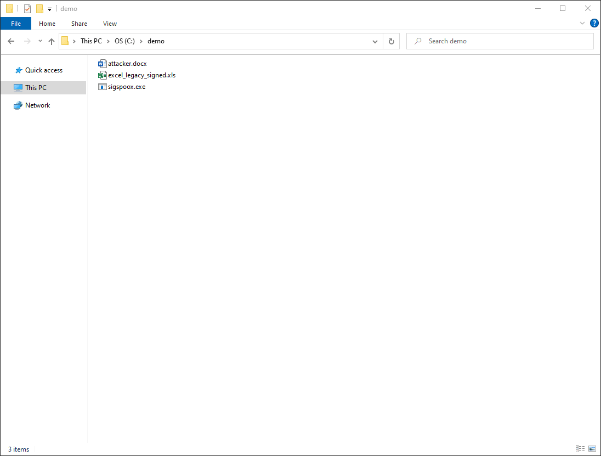
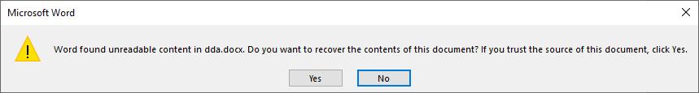
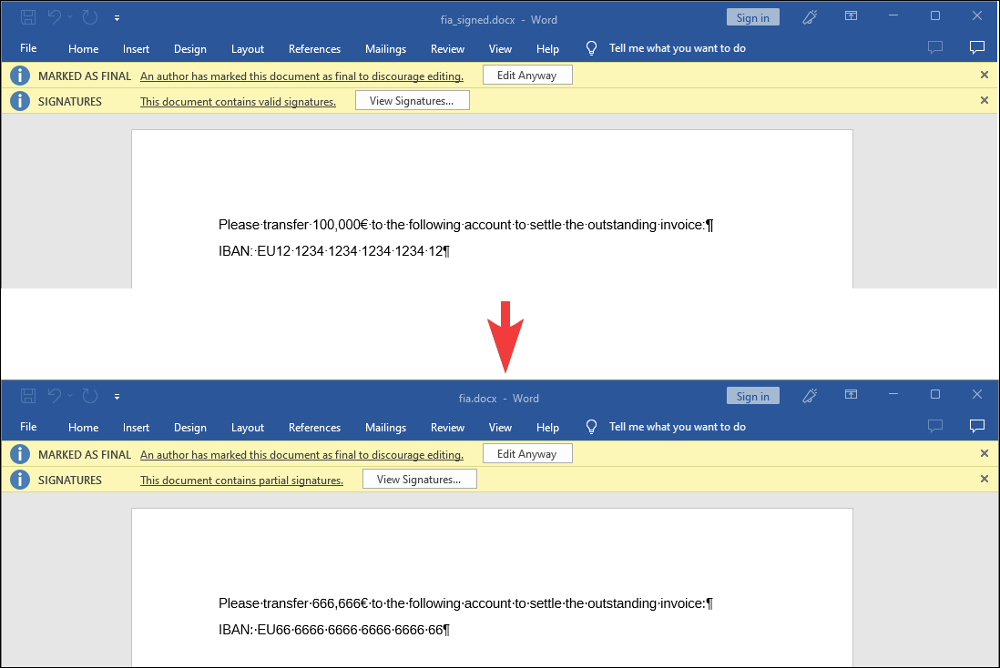
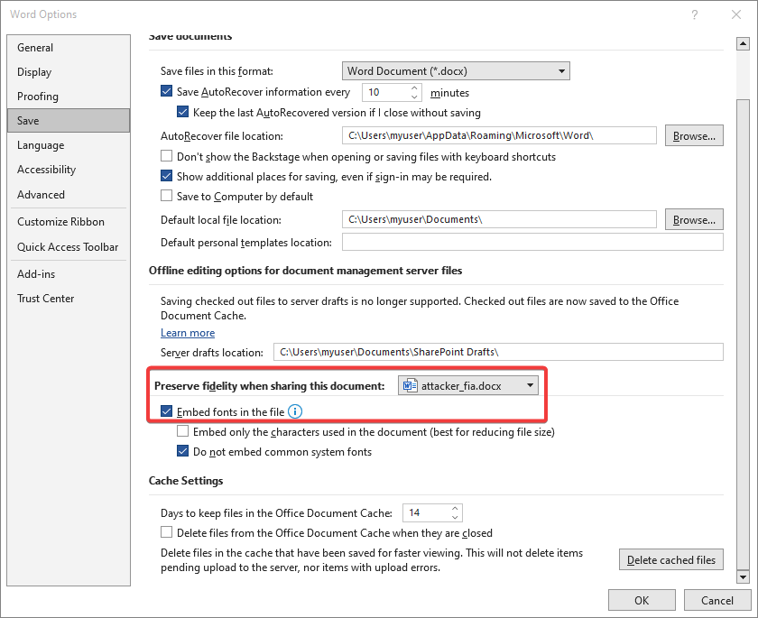
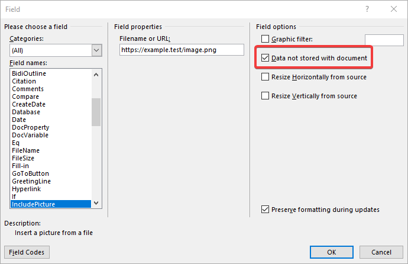
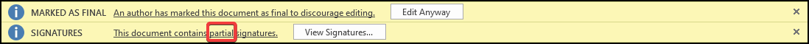

# sigSpOOX - Spoofing signatures in Office Open XML Documents (Word, Excel, Powerpoint)

It is possible to create Office documents which appear to be signed although they were never signed or the signer was presented a different document.

This is possible because the implementation of the signature verification only checks if the signature is valid.
It does *NOT* check if the displayed content is in fact signed.
This allows presenting different content to the user than what was actually signed.  
For details take a look at our [paper](https://www.usenix.org/conference/usenixsecurity23/presentation/rohlmann).

To get a feeling for the attacks the following GIF demonstrates the LWA-Excel attack:  



# Features
- Spoof Word document signatures
- Testcases with working testvectors
- Selfcheck if the XML Parser of Word still considers the testvectors as signed (requires an activated Word) 
- example files are avaiable in the 'files' folder
    - attacker: Contains files the attacker generated. In case of self-signed documents the "selfsigned" certificate was used.
    - results: Dummy folder with a dummy.txt which is only used for testing.
    - signed: Contains files that were signed with the "sigspoox" certificate.
    - supplementary_material: Contains additional files like used certificates (including the private keys) and a modified font
    - testvectors: Contains files that were created by sigspoox.exe and verified to be working correctly. Any new release of this tool is checked against these testvectors to confirm that everything is working correctly.

# Supported Attacks
These attacks were tested on the Office Versions 2013, 2016, 2019, 2021 and 365.
Vulnerable versions might start as far back as Office 2007, so it's essentially a 0-day.

 - [X] Universal Signature Forgery (USF)
    - [X] from Open Document Signature
 - [X] Malicious Repair Attack (MRA)
    - [X] Duplicate Document Attack (DDA)
    - [X] Evil Type Attack (ETA)
 - [X] Content Injection Attacks (CIA)
 - [X] Content Masking Attack (CMA)
    - [X] Style Injection Attack (SIA)
    - [X] Font Injection Attack (FIA)
 - [X] Legacy Wrapping Attacks (LWA)
	- [X] from signed xls
	- [X] from signed doc


# Usage and Attack Explanation

## Universal Signature Forgery (USF)
Any valid XML signature can be transformed into a valid Office signature because the `<SignedInfo>` element does not require the `<PackageInfo>` element to be referenced, meaning that the `<SignedInfo>` element does not contain a signature over the `<PackageInfo>` element.
Additionally, the hashes in the `<PackageInfo>` element are compared against the referenced files.
Thus, an attacker can create a self-signed malicious document and forge a valid signature by replacing the existing XML signature elements with a valid one, e.g., from a LibreOffice ODF Document or a SAML token.
To be more precise, the `<SignedInfo>`, `<SignatureValue>`, and `<KeyInfo>` which are direct children of the `<Signature>` element have to be overwritten with values from a valid XML signature.

Because the format of XML signatures differs for each use-case like a ODF signature or a SAML Token, a new transformation for each input signature style must be developed.
Currently only a signed ODT document is accepted as input.
Unfortunately there is a bug in LibreOffice that prevents signatures which were created with a certificate that has the MSB in the `<X509SerialNumber>` set from working.

```
sigspoox.exe usf -s odt_signed.odt -a attacker_selfsigned.docx -r usf_odt.docx
```

## Malicious Repair Attack (MRA)
Word offers a repair function if it detects a corrupted Word document:



This feature can be abused to insert two Word documents into one (DDA) or insert a signed Excel/Powerpoint document into the Word document (ETA).
If these files are opened, Word detects the corruption and offers the repair prompt.
If the user clicks on "Yes", Word first validates the signature, extracts the attacker's document and then displays it along with the "old" valid signature panel.

### Duplicate Document Attack (DDA)
Embeds a second word document into the signed one.

```
sigspoox.exe dda -s word_signed.docx -a attacker.docx -r dda.docx
```

### Evil Type Attack (ETA)
Embeds a word document into a signed Excel or Powerpoint.
The command is the same for Excel and Powerpoint files

```
sigspoox.exe eta -s excel_signed.xlsx -a attacker.docx -r eta_excel.docx
```

## Content Injection Attack (CIA)
It is possible to include content after signing because the file `/word/people.xml` is automatically included in the document, if it exists.
The idea is to create textboxes with malicious content and make them float above the originally signed text.
Thus, you can hide the original content and insert your own.

```
sigspoox.exe cia -s word_signed.docx -a attacker_cia.docx -r cia.docx
```

## Content Masking Attacks (CMA)
Documents can contain custom styles or fonts which are embedded in the document.
The idea is to create a custom style/font such that when they are applied, the document contains a malicious message.
After creating such a malicious document, the embedded style/font is removed which makes the document appear harmless.
Then the stripped file is given to the user who acts like a signing oracle and will sign the document because it contains a legitimate message.
After receiving the signed file, the stripped style/font files are injected back into the document.
The result is a signed document that contains the malicious content but has a valid signature from the user.

### Style Injection Attack (SIA)
For the style variant you have to create a custom style to hide the original text, e.g., by setting the font size to 1 and the text color to white. 
Then you format the text you want to hide with this custom style.
You must create a text that the victim will sign because the style will bestripped out before the document is signed.
This means that the victim will see the document without *any* styles.
The core of the attack is that the meaning of text can be altered by leaving out parts of it.
For example you can create a document that displays "You are promoted instead of being fired!" when it is signed but after inserting the styles back in, it will display "You are  fired!".

The attack consists of 2 steps:
1. Create a document that will be signed by the victim and execute the tool to remove the style from the document.
Thus, the signer will see the unmodified document.

```
sigspoox.exe sia-word-prepare -a attacker_sia.docx -r sia_word_prep.docx
```

2. Let the victim sign the document which appears unmodified.
Then add the style back to the document to complete the attack.

```
sigspoox.exe sia-word-final -s word_sia_prepared_signed.docx -r sia.docx
```

Additionally, new content can be inserted by appending it to the style.xml inside a `<body>` tag.
This is done automatically if an attacker document is specified as well:

```
sigspoox.exe sia-word-final -s word_sia_prepared_signed.docx -a attacker.docx -r sia.docx
```

### Font Injection Attack (FIA)
The same principle applies to custom fonts.
They can be removed before the document is signed but the document keeps the information that a part of it should be displayed with a different font.
Then the victim is displayed the document without *any custom* fonts at the time of signing.
Afterwards, the font is injected back into the document which renders the visual presentation of the signed document.

An example is to create a custom font that maps the digits 0-9 all to the digit 6 and use it in an invoice:




1. Create a malicious document, apply a custom font and embed it in the document:



2. Delete the reference to the embedded font:

```
sigspoox.exe fia-word-prepare -a attacker_fia.docx -r fia_word_prep.docx
```

3. Let the victim sign the document and add the reference to the custom font back in afterwards.

```
sigspoox.exe fia-word-final -s fia_signed.docx -r fia.docx
```

## Legacy Wrapping Attacks (LWA)
This attack requires that a legacy document .xls or .doc has been signed with a version of Office that is Office 2007 or later.
With Office 2007 the modern signature format based on XML signatures has been introduced.
Signed .xls or .doc files can be fully embedded into a docx document.
Although their structure is fundamentally different, the signature format is the same.
Similarly to USF, the signature verfication will validate the signature on the legacy document format while displaying the malicious Word document.

### LWA-Word
This attack requires a signing oracle because the attacker has to modify one byte in the .doc document before it can be signed.
Without this step, the .doc can NOT be embedded in to the docx without invalidating the signature.

This attack consists of 2 phases.
1. Generate a benign legacy .doc document with benign content that will be signed.

```
sigspoox.exe lwa-word-prepare -s word_legacy_benign.doc -r lwa_word_prep.doc
```

2. Receive the signed .doc back and inject it into your chosen content.

```
sigspoox.exe lwa-word-final -s word_legacy_lwa_prepared.doc -a attacker.docx -r lwa_word_final.docx
```

### LWA-Excel
For this attack you don't need a signing oracle because the .doc does not have to be manipulated before being signed. 
This means that if you find a signed .xls which is signed with a certificate that is still valid today, you can forge a valid signature.

```
sigspoox.exe lwa-excel -s excel_legacy_signed.xls -a attacker.docx -r lwa_excel.docx
```

## Bonus Attack "IncludePicture Switch"
This in an attack that can easily performed without the tool and thus is not implemented.
One can include a remote image in a document by using the field "IncludePicture". 
There are two ways to store the pictures, it can be stored directly in the document or only the link to the image is stored and it is automatically fetched again from the server when the document is opened.
By ticking the box "Data not stored in document" only the URL is stored in the document:



When such a document is opened it *automatically* reloads the image and does not invalidate the signature.
Thus an attacker can send a benign-looking document with an image which is fetched from a server he controls.
After the document is signed, the attacker can replace the original image with another one, e.g., an invoice with 10 times the original amount by changing the image which is located at the signed URL.
Potential victims will just see that the document was signed and be presented with the swapped image.

> I found it amusing to read that for what concerns external resources, the URL is protected by the signature, but not the actual content pointed by it... what an NFT-esque situation!
-- Anonymous Reviewer

## Check if attacks are fixed in the XML parser
This requires an activated and licensed copy of Word.
It opens all testvector files in a background instance of Word and checks if the XML parser still considers all signatures valid.

Before the checks can work you have to open a testvector file and trust the "sigspoox" certificate.

```
sigspoox.exe check
```

# TODOs
 - [ ] Cleanup Code
 - [ ] Look for better XML-Element selection instead of inprecise LINQ-queries
 - [ ] Stealth improvements, e.g., removing styles/fonts completely from the document-to-be-signed
 - [ ] Implement more signature transformations for USF, currently only ODF is supported
 - [ ] Maybe implement spoofing for lesser used formats like Excel and Powerpoint

# Used libraries
https://github.com/commandlineparser/commandline - for parsing the cmdline arguments  
https://github.com/ironfede/openmcdf - for extracting legacy formats (.doc, .xls)  

# FAQ

## How can I contact you?
You can send me an email via sigspoox (�t) pm.me.

## How can I protect myself?
Don't trust any document that contains "partial signatures". All attacks except USF show the message "partial signature" in the signature status line:



Until Microsoft releases a fix, you can only protect yourself against USF by checking if the `<SignedInfo>` element in `/word/_xmlsignatures/sig1.xml` contains a reference to the `<PackageInfo>` element.
If it does not, someone forged the signature.

## The tool does not work for me. Is it broken?
There are testcases that guarantee that it keeps working for the example documents contained in the testvectors folder.  
If it does not work for you this might be because the document you try to use is very complex.  
You can try to figure out the inner workings from our [paper](https://www.usenix.org/conference/usenixsecurity23/presentation/rohlmann).
I *won't* support you in spoofing a signature, you are on you own.

# Disclaimer
By releasing this tool I hope to spark more research in the area of document security in general, not only limited to digital signatures.
This tool is *NOT* affiliated with the Ruhr-University Bochum because it was developed in my spare time after I had finished my Master's degree.  

All vulnerabilities were reported to Microsoft via the Microsoft Security Response Center.
| Report Date |          Attack          |
|:-----------:|:------------------------:|
| 2021-01-05  | MRA (DDA, ETA), LWA-Word |
| 2021-01-25  | LWA-Excel                |
| 2022-02-18  | USF                      |
| 2022-06-08  | CIA, CMA Font, CMA Style |

The vulnerabilities have been acknowledged by Microsoft but Microsoft does not believe that immediate attention is required. However, a potential fix in the future is not ruled out by Microsoft. Since the attacks break the security goals of signatures, such as integrity, authenticity and non-repudiation, Microsoft's decision is not comprehensible to us.

# Acknowledgements

thanks to:
- [@gotofailure](https://twitter.com/gotofailure) ([github](https://github.com/neverhub)) for beta-testing